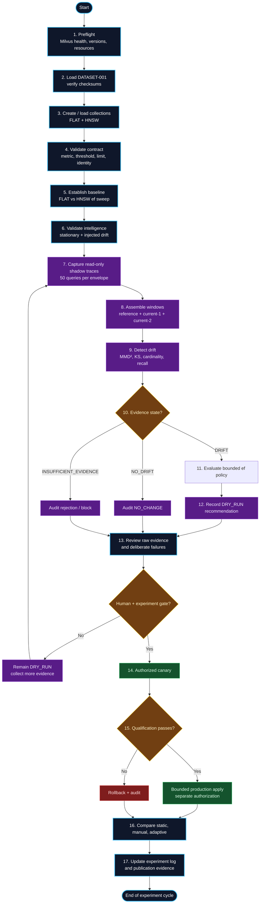
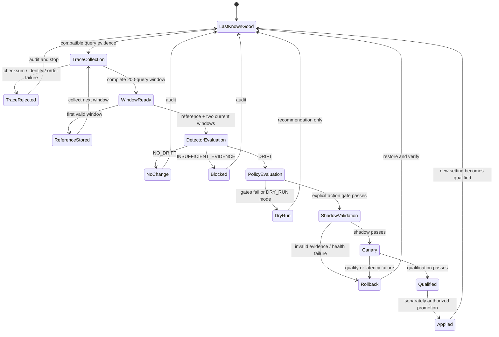
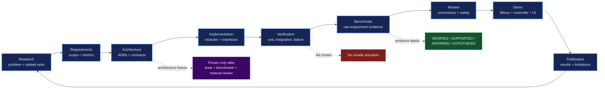

# 01 — Current Repository Structure

```mermaid
flowchart TD
    ROOT["VD — Adaptive Vector DB Tuning System"]

    ROOT --> GOVERNANCE["Governance & research docs"]
    GOVERNANCE --> AGENTS["AGENTS.md"]
    GOVERNANCE --> README["README.md"]
    GOVERNANCE --> ARCH["ARCHITECTURE.md"]
    GOVERNANCE --> RESEARCH["RESEARCH_PLAN.md"]
    GOVERNANCE --> ROADMAP["ROADMAP.md"]
    GOVERNANCE --> EXPLOG["EXPERIMENT_LOG.md"]
    GOVERNANCE --> HANDOFF["HANDOFF_TEMPLATE.md"]
    GOVERNANCE --> DESIGN["SYSTEM_DESIGN.md"]
    GOVERNANCE --> REPORT["PROJECT_REPORT.md"]
    GOVERNANCE --> BIBLE["PROJECT_BIBLE.md"]
    GOVERNANCE --> SESSION["SESSION_HANDOFF.md"]

    ROOT --> SOURCE["src/vdbench — product code"]
    SOURCE --> CORE["Core contracts"]
    CORE --> CONFIG["config.py"]
    CORE --> PROTOCOL["protocol.py"]
    CORE --> DATASET["dataset.py"]
    CORE --> ORACLE["oracle.py"]
    SOURCE --> BACKEND["Milvus integration"]
    BACKEND --> MILVUS["milvus.py"]
    BACKEND --> MILVUS_ACT["milvus_actuation.py"]
    BACKEND --> RUNNER["runner.py"]
    SOURCE --> ADAPTIVE["Adaptive intelligence"]
    ADAPTIVE --> DRIFT["drift.py"]
    ADAPTIVE --> POLICY["policy.py"]
    ADAPTIVE --> MONITOR["workload_monitor.py"]
    SOURCE --> SAFETY["Safety & persistence"]
    SAFETY --> ACTUATION["actuation.py"]
    SAFETY --> ACT_STORE["actuation_persistence.py"]
    SAFETY --> LKG["last_known_good.py"]
    SOURCE --> EVIDENCE["Evidence pipeline"]
    EVIDENCE --> SHADOW["exp005_acquisition.py"]
    EVIDENCE --> SHADOW_ART["shadow_artifacts.py"]
    EVIDENCE --> SHADOW_EXT["shadow_extraction.py"]
    EVIDENCE --> SHADOW_WIN["shadow_window.py"]
    EVIDENCE --> ARTIFACTS["artifacts.py"]
    SOURCE --> SUPPORT["Metrics & interface"]
    SUPPORT --> METRICS["metrics.py"]
    SUPPORT --> CLI["cli.py / __main__.py"]

    ROOT --> TESTS["tests — verification"]
    TESTS --> UNIT["contracts, metrics, oracle"]
    TESTS --> INT["Milvus, actuation, shadow"]
    TESTS --> STAT["drift and stationary replay"]
    TESTS --> FAILURE["failure and recovery tests"]

    ROOT --> ARTIFACT_ROOT["artifacts/exp-001 — reproducible evidence"]
    ARTIFACT_ROOT --> DATA["dataset/\narrays, thresholds, checksums"]
    ARTIFACT_ROOT --> ENV["environment/\nDocker, host, lockfiles"]
    ARTIFACT_ROOT --> RUNS["run-* / quarantine/\nraw experiment outputs"]

    ROOT --> CONFIG_FILES["pyproject.toml\nproject configuration"]

    classDef root fill:#0f172a,color:#fff,stroke:#38bdf8,stroke-width:3px;
    classDef docs fill:#172554,color:#dbeafe,stroke:#60a5fa;
    classDef source fill:#052e16,color:#dcfce7,stroke:#4ade80;
    classDef tests fill:#451a03,color:#ffedd5,stroke:#fb923c;
    classDef artifacts fill:#3b0764,color:#f3e8ff,stroke:#c084fc;
    classDef config fill:#334155,color:#f8fafc,stroke:#94a3b8;

    class ROOT root;
    class GOVERNANCE,AGENTS,README,ARCH,RESEARCH,ROADMAP,EXPLOG,HANDOFF,DESIGN,REPORT,BIBLE,SESSION docs;
    class SOURCE,CORE,CONFIG,PROTOCOL,DATASET,ORACLE,BACKEND,MILVUS,MILVUS_ACT,RUNNER,ADAPTIVE,DRIFT,POLICY,MONITOR,SAFETY,ACTUATION,ACT_STORE,LKG,EVIDENCE,SHADOW,SHADOW_ART,SHADOW_EXT,SHADOW_WIN,ARTIFACTS,SUPPORT,METRICS,CLI source;
    class TESTS,UNIT,INT,STAT,FAILURE tests;
    class ARTIFACT_ROOT,DATA,ENV,RUNS artifacts;
    class CONFIG_FILES config;
```

# 02 — How the System Works

```mermaid
flowchart LR
    USER["Application / API"] --> QUERY["Range query"]
    QUERY --> MILVUS["Milvus HNSW\nserving path"]
    MILVUS --> RESULT["Results + latency"]

    QUERY -. sampled asynchronously .-> SHADOW["Shadow trace producer"]
    SHADOW --> CANDIDATE["Candidate ef"]
    SHADOW --> LKG["Last-known-good ef"]
    CANDIDATE --> FLAT["Milvus FLAT\nexact reference"]
    LKG --> FLAT
    CANDIDATE --> ORACLE["Independent exact oracle"]
    LKG --> ORACLE
    FLAT --> TRACE["50-query immutable trace"]
    ORACLE --> TRACE
    SHADOW --> TRACE

    TRACE --> PERSIST["Persist + checksum"]
    PERSIST --> EVENT["Trace event"]
    EVENT --> MONITOR["Restart-safe monitor"]
    MONITOR --> WINDOW["4 traces × 50\n= 200-query window"]
    WINDOW --> EVIDENCE["Evidence provenance"]
    EVIDENCE --> DETECTOR["Drift detector"]
    DETECTOR -->|NO_DRIFT| NO_CHANGE["NO_CHANGE"]
    DETECTOR -->|DRIFT| POLICY["Tuning policy"]
    DETECTOR -->|INSUFFICIENT_EVIDENCE| BLOCK["Block + audit"]
    POLICY --> DRY_RUN["DRY_RUN recommendation"]
    DRY_RUN --> AUDIT["Audit record"]
    DRY_RUN -. future authorized path .-> SAFETY["Safe actuation"]
    SAFETY --> CANARY["Shadow / canary"]
    CANARY -->|pass| APPLY["Bounded apply"]
    CANARY -->|fail| ROLLBACK["Restore last-known-good"]

    classDef input fill:#1e3a8a,color:#dbeafe,stroke:#60a5fa;
    classDef backend fill:#14532d,color:#dcfce7,stroke:#4ade80;
    classDef evidence fill:#581c87,color:#f3e8ff,stroke:#c084fc;
    classDef intelligence fill:#7c2d12,color:#ffedd5,stroke:#fb923c;
    classDef safety fill:#7f1d1d,color:#fee2e2,stroke:#f87171;
    classDef safe fill:#14532d,color:#dcfce7,stroke:#86efac;

    class USER,QUERY input;
    class MILVUS,RESULT,FLAT,ORACLE backend;
    class SHADOW,CANDIDATE,LKG,TRACE,PERSIST,EVENT,MONITOR,WINDOW,EVIDENCE,AUDIT evidence;
    class DETECTOR,NO_CHANGE,POLICY,DRY_RUN,BLOCK intelligence;
    class SAFETY,CANARY,ROLLBACK safety;
    class APPLY safe;
```

# 03 — End-to-End Workflow

```mermaid
flowchart TD
    START(["Start"])
    START --> PREFLIGHT["1. Preflight\nMilvus health, versions, resources"]
    PREFLIGHT --> DATASET["2. Load DATASET-001\nverify checksums"]
    DATASET --> COLLECTIONS["3. Create / load collections\nFLAT + HNSW"]
    COLLECTIONS --> CONTRACT["4. Validate contract\nmetric, threshold, limit, identity"]
    CONTRACT --> BASELINE["5. Establish baseline\nFLAT vs HNSW ef sweep"]
    BASELINE --> OFFLINE["6. Validate intelligence\nstationary + injected drift"]
    OFFLINE --> SHADOW["7. Capture read-only shadow traces\n50 queries per envelope"]
    SHADOW --> WINDOWS["8. Assemble windows\nreference + current-1 + current-2"]
    WINDOWS --> DETECT["9. Detect drift\nMMD², KS, cardinality, recall"]
    DETECT --> DECISION{"10. Evidence state?"}
    DECISION -->|NO_DRIFT| AUDIT_NO["Audit NO_CHANGE"]
    DECISION -->|INSUFFICIENT_EVIDENCE| AUDIT_BLOCK["Audit rejection / block"]
    DECISION -->|DRIFT| POLICY["11. Evaluate bounded ef policy"]
    POLICY --> DRY["12. Record DRY_RUN recommendation"]
    DRY --> REVIEW["13. Review raw evidence\nand deliberate failures"]
    AUDIT_NO --> REVIEW
    AUDIT_BLOCK --> REVIEW
    REVIEW --> GATE{"Human + experiment gate?"}
    GATE -->|No| DRY_RUN_LOOP["Remain DRY_RUN\ncollect more evidence"]
    DRY_RUN_LOOP --> SHADOW
    GATE -->|Yes| CANARY["14. Authorized canary"]
    CANARY --> QUALIFY{"15. Qualification passes?"}
    QUALIFY -->|No| ROLLBACK["Rollback + audit"]
    QUALIFY -->|Yes| APPLY["Bounded production apply\nseparate authorization"]
    APPLY --> BENCHMARK["16. Compare static, manual, adaptive"]
    ROLLBACK --> BENCHMARK
    BENCHMARK --> REPORT["17. Update experiment log\nand publication evidence"]
    REPORT --> END(["End of experiment cycle"])

    classDef phase fill:#0f172a,color:#fff,stroke:#38bdf8,stroke-width:2px;
    classDef evidence fill:#581c87,color:#f3e8ff,stroke:#c084fc;
    classDef decision fill:#713f12,color:#fef3c7,stroke:#facc15;
    classDef safe fill:#14532d,color:#dcfce7,stroke:#4ade80;
    classDef blocked fill:#7f1d1d,color:#fee2e2,stroke:#f87171;

    class START,END phase;
    class PREFLIGHT,DATASET,COLLECTIONS,CONTRACT,BASELINE,OFFLINE,REVIEW,BENCHMARK,REPORT phase;
    class SHADOW,WINDOWS,DETECT,DRY,AUDIT_NO,AUDIT_BLOCK,DRY_RUN_LOOP evidence;
    class DECISION,GATE,QUALIFY decision;
    class CANARY,APPLY safe;
    class ROLLBACK blocked;
```

# 04 — Safe Actuation and Rollback

```mermaid
stateDiagram-v2
    [*] --> LastKnownGood

    LastKnownGood --> TraceCollection: compatible query evidence
    TraceCollection --> TraceRejected: checksum / identity / order failure
    TraceRejected --> LastKnownGood: audit and stop

    TraceCollection --> WindowReady: complete 200-query window
    WindowReady --> ReferenceStored: first valid window
    ReferenceStored --> TraceCollection: collect next window
    WindowReady --> DetectorEvaluation: reference + two current windows

    DetectorEvaluation --> NoChange: NO_DRIFT
    DetectorEvaluation --> Blocked: INSUFFICIENT_EVIDENCE
    DetectorEvaluation --> PolicyEvaluation: DRIFT
    NoChange --> LastKnownGood: audit
    Blocked --> LastKnownGood: audit

    PolicyEvaluation --> DryRun: gates fail or DRY_RUN mode
    PolicyEvaluation --> ShadowValidation: explicit action gate passes
    DryRun --> LastKnownGood: recommendation only

    ShadowValidation --> Rollback: invalid evidence / health failure
    ShadowValidation --> Canary: shadow passes
    Canary --> Rollback: quality or latency failure
    Canary --> Qualified: qualification passes
    Qualified --> Applied: separately authorized promotion
    Applied --> LastKnownGood: new setting becomes qualified
    Rollback --> LastKnownGood: restore and verify
```

# 05 — Research-to-Demo Delivery Loop

```mermaid
flowchart LR
    R1["Research\nproblem + related work"] --> R2["Requirements\nscope + metrics"]
    R2 --> R3["Architecture\nADRs + contracts"]
    R3 --> R4["Implementation\nmodules + interfaces"]
    R4 --> R5["Verification\nunit, integration, failure"]
    R5 --> R6["Benchmark\nraw experiment evidence"]
    R6 --> R7["Review\ncorrectness + safety"]
    R7 --> R8["Demo\nMilvus + controller + UI"]
    R8 --> R9["Publication\nresults + limitations"]
    R9 --> R1

    R3 -. architecture freeze .-> FREEZE["Frozen only after\ntests + benchmark + manual review"]
    R5 -. fail closed .-> SAFETY["No unsafe actuation"]
    R6 -. evidence labels .-> EVIDENCE["VERIFIED / SUPPORTED /\nINFERRED / HYPOTHESIS"]

    classDef main fill:#172554,color:#dbeafe,stroke:#60a5fa,stroke-width:2px;
    classDef governance fill:#3b0764,color:#f3e8ff,stroke:#c084fc;
    classDef safety fill:#7f1d1d,color:#fee2e2,stroke:#f87171;
    classDef evidence fill:#14532d,color:#dcfce7,stroke:#4ade80;

    class R1,R2,R3,R4,R5,R6,R7,R8,R9 main;
    class FREEZE governance;
    class SAFETY safety;
    class EVIDENCE evidence;
```
