# Software Requirements Specification — Adaptive Vector DB Tuning System

Document ID: `SRS-VD-001`
Version: `1.0.0`
Status: Baseline requirements specification
Date: 2026-08-04
System baseline: Git `2d56463` (`test: add sealed EXP-009 Stage-4 offline composition verifier`)
Primary implementation: Python package `vdbench`

## 1. Purpose

This Software Requirements Specification (SRS) defines the required behavior, boundaries, safety properties, evidence obligations, interfaces, and acceptance criteria for the Adaptive Vector DB Tuning System.

The system is a research-grade reference implementation for online, workload-aware tuning of Milvus **range/threshold queries** under workload drift. It observes completed range queries, derives bounded immutable evidence, detects drift statistically, evaluates a safe tuning policy, and provides a rollback-capable actuation boundary. The system prioritizes correctness, research validity, reproducibility, and safe failure over tuning frequency or delivery speed.

This SRS is requirements-focused. It does not replace:

- `AGENTS.md` for operating governance and delivery discipline;
- `ARCHITECTURE.md` for normative ADR decisions and parameter registry;
- `EXPERIMENT_LOG.md` for empirical contracts and results;
- `RESEARCH_PLAN.md` for hypotheses, literature, and publication claims; or
- `ROADMAP.md` for current sequencing and task status.

When this SRS conflicts with an accepted ADR or a newer explicit human instruction, the ADR or instruction prevails. Changes to a requirement that alter an accepted architectural principle require a superseding ADR and evidence plan.

## 2. Document control and evidence language

### 2.1 Requirement keywords

The terms **MUST**, **MUST NOT**, **SHALL**, **SHALL NOT**, **SHOULD**, **SHOULD NOT**, and **MAY** are normative.

### 2.2 Evidence labels

Every claim about the system SHALL use one of the following labels:

| Label | Meaning |
|---|---|
| **VERIFIED** | Measured and recorded in an EXP entry with reviewable raw evidence. |
| **SUPPORTED** | Supported by cited external literature or official documentation, but not locally measured. |
| **INFERRED** | Reasoned from design or implementation, without experimental confirmation. |
| **HYPOTHESIS** | Plausible but unvalidated research proposition. |

A passing unit test, a commit message, or an implementation alone MUST NOT be reported as a VERIFIED empirical claim.

### 2.3 Current delivery baseline

| Area | Current evidence status | Important limitation |
|---|---|---|
| Milvus range-query smoke baseline | VERIFIED by EXP-001/EXP-004. | It is a smoke contract, not proof of optimal tuning or production readiness. |
| Stationary trace-to-policy DRY_RUN pipeline | VERIFIED by EXP-005 and EXP-008. | Stationary evidence does not prove drift-response efficacy or authorize actuation. |
| Drift detector correction | VERIFIED for registered stationary/injection reruns by ADR-003 evidence. | Not live-production drift detection evidence by itself. |
| Provenance, monitor, and durable outbox | VERIFIED in their registered scopes by EXP-005, EXP-006, and EXP-007. | Single-host reference scope; no external-host deployment claim. |
| Host recorder/worker/reference gateway | VERIFIED for reference in-process, read-only composition by EXP-008. | No external serving application integration or actuation authorization. |
| EXP-009 canary Stage 1 | VERIFIED offline workload/statistics preflight. | Does not route a candidate or prove live no-interference. |
| EXP-009 canary Stage 2 | VERIFIED offline approval, route-partition, lifecycle, restart, and expiry failback contracts. | No live candidate query. |
| EXP-009 canary Stage 3 | VERIFIED offline rollback containment and activation-interlock contracts. | No live candidate query or live restoration. |
| EXP-009 canary Stage 4 | In progress: admission, schedule, ledger, evaluator, and fake-only serial composition are implemented offline. | Sealed independently verified composition evidence is still required; controlled live canary remains human-gated. |
| Automatic configuration change or full-traffic promotion | Not authorized. | No requirement in this baseline permits automatic full-traffic tuning. |

## 3. Product scope

### 3.1 Core objective

The system SHALL support the following Core research workflow on one backend, Milvus:

1. Serve or observe explicit L2 and COSINE distance-threshold range queries.
2. Preserve a reproducible and identity-bound evidence trail for those queries.
3. Detect workload and quality drift using statistically specified, metric-stratified evidence.
4. Evaluate an adjacent-step HNSW query-time `ef` tuning policy without embedding database calls in the detector or policy.
5. Remain DRY_RUN/LKG-only until all transition-specific evidence, safety gates, and human authorization requirements are satisfied.
6. Provide a bounded, human-gated reference-canary path and rollback boundary for one exact candidate transition only after its separate preconditions are met.

### 3.2 In scope

- Milvus Standalone range/threshold queries using HNSW and FLAT tracks.
- Metrics `L2` and `COSINE`, evaluated independently.
- Query-time HNSW `ef` selection from registered values.
- Exact float64 oracle and FLAT semantic checks.
- Immutable evidence/provenance, deterministic audit sampling, detector windows, policy decisions, durable audit records, and restart-safe state.
- A single-host, single-logical-consumer durable trace outbox.
- A framework-neutral in-process observation recorder, background shadow worker, and reference serving gateway.
- DRY_RUN detector-to-policy evaluation and non-actuating safety checks.
- The strictly bounded EXP-009 reference-canary design, subject to the explicit gates in this SRS.

### 3.3 Explicitly out of scope

The following SHALL NOT be added to the Core implementation without a scope decision and, where material, a new ADR:

- k-NN/top-k or generic ANN tuning as a primary workload;
- hybrid, attribute-filtered, multi-tenant, or multi-backend tuning;
- policy transfer across database products;
- a new HTTP/gRPC serving product, external application deployment, user-facing dashboard, or authentication product;
- multi-host queue/broker semantics, distributed ordering, or multi-node routing;
- server-side Milvus index/schema/collection/configuration mutation as a canary mechanism;
- autonomous or full-traffic tuning; and
- unsupported production-latency, IID, or causal-workload claims.

## 4. Stakeholders and operating roles

| Role | Responsibilities |
|---|---|
| Research owner / operator | Defines research scope, reviews results, retains external approval-key control, and supplies any one-time candidate-routing grant. |
| System operator | Starts/stops the reference stack, protects owner-only state/artifact paths, runs approved experiments, and investigates explicit fail-closed states. |
| Host integrator | Calls the framework-neutral recorder only after the host query response is complete; does not move monitoring work into the foreground path. |
| Evidence reviewer | Independently verifies manifests, hashes, raw output, source revision, test output, and claim scope. |
| Implementation maintainer | Preserves typed contracts, compatibility, reproducibility, safety gates, and requirement traceability. |

No role may obtain live candidate routing solely from a policy decision, test fixture, local code path, or an internally generated key.

## 5. Operating context and system boundaries

```mermaid
flowchart LR
    HOST["Reference host / post-response hook"] --> REC["Bounded observation recorder"]
    REC --> WORKER["Background shadow worker"]
    WORKER --> SHADOW["Read-only shadow + FLAT + oracle"]
    SHADOW --> OUTBOX["Durable trace outbox"]
    OUTBOX --> MON["DRY_RUN workload monitor"]
    MON --> DET["Metric-stratified detector"]
    DET --> POL["Pure tuning policy"]
    POL --> AUDIT["Durable decision/audit evidence"]
    POL -. "recommend only by default" .-> OP["Human/operator"]
    OP -. "future exact signed grant only" .-> CANARY["Bounded canary coordinator"]
    CANARY -. "LKG failback / rollback" .-> ROUTE["In-memory route authority"]
    HOST --> SERVE["One explicit HNSW range query"]
    SERVE --> MILVUS["Milvus + FLAT reference track"]
    SHADOW --> MILVUS
```

### 5.1 Boundary rules

- The detector and policy are pure domain components and SHALL NOT import or invoke PyMilvus.
- The foreground host SHALL own its response and query result. Monitoring is post-response and non-blocking.
- The shadow worker alone MAY invoke injected background read-only shadow work.
- The outbox SHALL persist a validated immutable trace before publishing it.
- The monitor SHALL consume immutable events and derive decisions; it SHALL NOT reconstruct raw query vectors from monitor state.
- The canary activation/routing boundary is a separate human-gated authority. It SHALL NOT be reached by the detector or policy alone.

## 6. Definitions

| Term | Definition |
|---|---|
| **Range/threshold query** | A vector search with explicit metric-specific radius/range-filter semantics and `limit=100`, rather than a top-k request. |
| **Foreground query** | The host-owned HNSW range query whose response is served independently from monitoring. |
| **Shadow audit** | Background FLAT, sentinel-HNSW, candidate, LKG, and oracle evidence collection over a bounded audited subset. |
| **Stream** | An exact `MonitorStreamKey`: metric, canonical threshold stratum, identities, and other lineage fields that cannot be mixed. |
| **Reference window** | Immutable, accepted 200-query baseline for one metric/stratum and identity contract. |
| **Current window** | Ordered, non-overlapping 200-query evidence window compared to the immutable reference. |
| **Audit sample** | Exactly 50 deterministic, stable-hash selected query IDs from a complete 200-query window. |
| **Sentinel** | HNSW `ef=100`, used only for fixed-effort quality observation; it is never an actuation candidate or LKG configuration. |
| **LKG** | Last-known-good eligible `ef`, qualified by exact evidence and persisted durably. |
| **DRY_RUN** | A mode in which the system may evaluate, recommend, and audit but SHALL NOT install candidate routing or change live configuration. |
| **Canary** | A separately approved, bounded reference route that sends a fixed fraction of frozen occurrences with a candidate query-time `ef`; it is not a server configuration mutation. |
| **Fail closed** | Missing, invalid, incomplete, stale, mismatched, unhealthy, or unverified input produces refusal, `INSUFFICIENT_EVIDENCE`, LKG-only routing, or a disabled action path—not a benign/default pass. |

## 7. External dependencies and fixed constraints

### 7.1 Backend and runtime

| Dependency | Requirement |
|---|---|
| Primary backend | Milvus Standalone is the sole active Core backend. Qdrant is an unimplemented fallback only. |
| Milvus version | ENV-001 pins Milvus `3.0.0` at digest `sha256:49371c30af46b1013e4d3e0b980e691d81376d69cdbe1b372725baf1d7255862`. |
| Python client | PyMilvus `3.0.1` for the reference environment. |
| Runtime | Python package `vdbench`, Python `>=3.11`; the reference evidence environment is macOS arm64/Python 3.14. |
| Statistical runtime | NumPy and deterministic PCG64 are required for registered statistical procedures. |
| Approval verification | `cryptography==49.0.0` and Ed25519 public-key verification are required for the proposed EXP-009 approval boundary. |
| Durable state | Local private files and SQLite are permitted only for their designated single-host stores. |

### 7.2 Environment and query constraints

The reference environment and any experiment claiming comparability SHALL bind dataset, source revision, dependency lock, collection/data/index/FLAT/HNSW identities, configuration, health, resource context, and artifact hashes.

The EXP-001 reference query contract uses:

| Parameter | Requirement |
|---|---|
| Metrics | `L2` and `COSINE`, never mixed in a stream/window/decision. |
| Index tracks | `FLAT` exact reference and `HNSW` approximate track. |
| HNSW build | `M=16`, `efConstruction=200`; build changes require a new experiment and index identity. |
| Result limit | Exactly `100`. |
| Consistency | Explicit `Strong` where supported by the benchmark/reference contract. |
| HNSW sweep | `{100, 200, 400, 800, 1600}` for EXP-001 measurement. |
| Actuation ladder | `{200, 400, 800, 1600}` only; adjacent moves only. |
| Sentinel | `ef=100` only. It SHALL NOT be candidate or LKG. |

The system SHALL validate metric-specific radius and range-filter ordering before every execution path that performs a search. It SHALL reject non-finite values, mismatched dimensions, unregistered `ef`, `ef < limit`, identity mismatch, or threshold-semantic failure before treating evidence as valid.

## 8. Functional requirements

### 8.1 Range-query correctness and baseline requirements

| ID | Requirement | Verification |
|---|---|---|
| FR-001 | The system SHALL support only explicit L2 and COSINE range/threshold queries in the Core path. It SHALL validate metric-specific radius/range-filter semantics and reject mixed metrics. | Unit/integration boundary fixtures; EXP-001. |
| FR-002 | Every accepted search contract SHALL carry an explicit metric, radius, range filter, `limit=100`, served `ef`, consistency/identity context, and canonical query ID. No hidden query-time default is permitted. | Typed-contract tests; artifact inspection. |
| FR-003 | The system SHALL use FLAT plus the independent float64 oracle as correctness references. HNSW output SHALL NOT substitute for exact cardinality or oracle semantics. | Oracle/adapter tests; EXP-001/EXP-005 evidence. |
| FR-004 | The system SHALL verify collection/data/index/build identity before and after evidence-critical runs. Identity or semantic disagreement SHALL invalidate the affected evidence rather than being classified as workload drift. | Deliberate identity/semantic-failure tests; EXP evidence. |
| FR-005 | The system SHALL record source revision, seed, dataset identity, configuration, environment identity, raw result, and immutable hashes for each experiment. | Experiment verifier and manifest review. |

### 8.2 Foreground observation and serving requirements

| ID | Requirement | Verification |
|---|---|---|
| FR-010 | A host integration SHALL submit a `CompletedRangeQueryObservation` only after its foreground response is complete. | Reference gateway/host integration tests; EXP-008. |
| FR-011 | `HostObservationRecorder.offer()` SHALL use bounded, non-blocking in-memory admission only. It SHALL NOT contact Milvus, write a file, wait for a worker, retry, publish, evaluate policy, or invoke actuation. | Dependency-trap and queue-full tests. |
| FR-012 | Queue-full, closed, invalid, or unavailable monitoring state SHALL return an observable, non-sensitive receipt such as a backpressure drop; it SHALL NOT alter or fail the served query. | Deliberate queue/error tests; EXP-008 H1/H4 evidence. |
| FR-013 | The reference serving executor SHALL perform exactly one explicit HNSW range search for an accepted foreground request. It SHALL NOT perform FLAT/oracle/shadow/policy/action work, retry, write state, or mutate Milvus. | Adapter tests and live read-only evidence. |
| FR-014 | Foreground serving preflight SHALL be separate from request execution and SHALL validate health, loaded state, identities, dimensions, registered range parameters, and allowed served `ef`. | Preflight failure tests. |
| FR-015 | A foreground search exception SHALL produce a minimal failed/timeout outcome for the host; it SHALL NOT cause fabricated trace or detector evidence. | Failure-injection tests. |

### 8.3 Background shadow-audit requirements

| ID | Requirement | Verification |
|---|---|---|
| FR-020 | The background worker SHALL group exactly 50 compatible observations for one exact stream before requesting a shadow trace. It SHALL preserve FIFO order within that stream and SHALL NOT join different metrics, strata, identities, bindings, or configurations. | Worker grouping/isolation tests; EXP-008. |
| FR-021 | A worker SHALL derive trace/window sequence identifiers only after a full compatible group exists. It SHALL use four trace groups to form a 200-query monitor window. | Stateful worker/monitor tests. |
| FR-022 | The injected shadow executor SHALL perform read-only shadow work only and SHALL use the existing audited trace semantics rather than reimplementing range search/oracle/FLAT logic. | Dependency and live-read-only tests. |
| FR-023 | A trace SHALL be accepted only when its 50 canonical query IDs, ordering, metric/stratum, query contract, served `ef`, collection/data/configuration identities, and FLAT/HNSW bindings exactly match its input observations and registered plan. | Mismatch, timeout, incomplete-trace tests. |
| FR-024 | The worker SHALL reject incomplete, failed, timed-out, identity-mismatched, semantic-invalid, or structurally mismatched traces with explicit non-sensitive reasons and SHALL NOT publish them. | Deliberate failure tests. |
| FR-025 | Partial raw batches SHALL remain volatile. On restart, the system SHALL record only non-sensitive partial-count/restart-loss state, clear unverifiable partials, and SHALL NOT fabricate or replay an unknown trace. | Restart tests. |
| FR-026 | The reference `MilvusHostShadowExecutor` SHALL verify required service health, collection load state, and identities before and after shadow work; it SHALL invoke only the read-only shadow operation and SHALL restore an injected trace-sink state in a `finally` path. | Fake and live read-only tests. |

### 8.4 Durable trace source and event requirements

| ID | Requirement | Verification |
|---|---|---|
| FR-030 | A valid immutable shadow trace SHALL be persisted durably before publication. A trace SHALL NOT be published first and persisted later. | EXP-007 ordering/crash tests. |
| FR-031 | The source/outbox SHALL provide single-host, at-least-once delivery with explicit acknowledgement. The monitor's durable deduplication boundary SHALL provide exactly-once effect. | EXP-007 restart/redelivery/composition evidence. |
| FR-032 | Publication outcomes other than confirmed `PUBLISHED` or `IDEMPOTENT` SHALL block the affected stream for explicit recovery. The worker SHALL NOT reuse an ambiguous trace slot. | Unknown-publication failure tests. |
| FR-033 | The outbox SHALL have registered bounds for queue capacity, payload size, drain work, retention, and backpressure. It SHALL expose explicit drop/block reasons and SHALL NOT retain unbounded raw data. | Backpressure/resource tests. |
| FR-034 | Durable trace/event stores SHALL reject symlinks, unsafe paths, incorrect owner/permission posture, malformed envelope/schema, duplicate conflict, checksum mismatch, and corrupted persisted state. | Path, permission, corruption, duplicate, and restart tests. |
| FR-035 | The durable event payload SHALL minimize data: it may retain the owner-only immutable trace required for review, but SHALL NOT duplicate raw vectors/hits into monitor state, drop counters, ordinary logs, exception text, policy state, or grants. | Schema/audit inspection and privacy tests. |

### 8.5 Detector requirements

| ID | Requirement | Verification |
|---|---|---|
| FR-040 | The detector SHALL evaluate L2 and COSINE independently. It SHALL NOT pool vectors, thresholds, cardinalities, recall values, p-values, windows, or decisions across metrics. | Cross-metric rejection tests. |
| FR-041 | A reference window and each current window SHALL contain exactly 200 eligible queries for one metric/stratum and matching identity/query contracts. Current windows SHALL be ordered and non-overlapping. Reference updates require an approved rebaseline; a drift alarm SHALL NOT rebaseline automatically. | Window assembler/replay tests; EXP-005/EXP-008. |
| FR-042 | The detector SHALL select exactly 50 audit IDs from each complete window using the registered canonical serialization, SHA-256-derived BLAKE2b key, keyed BLAKE2b ranking, and deterministic tie-break. | Determinism/fixture tests. |
| FR-043 | The detector SHALL evaluate four signals: query-vector distribution, threshold distribution, exact uncapped cardinality distribution, and sentinel fixed-effort recall. | Detector unit and registered replay tests. |
| FR-044 | The query-vector signal SHALL use a deterministic corrected MMD procedure: label-independent pooled preprocessing/kernel construction, pooled zero-variance exclusion, float64 arithmetic, and label permutation only over a fixed combined kernel. It SHALL NOT use the superseded reference-only preprocessing rule. | ADR-003 regression and independent calculation checks. |
| FR-045 | The detector SHALL use exactly 9,999 PCG64 label permutations per signal/window, with a SHA-256-derived deterministic seed over the registered canonical tuple. It SHALL persist seed provenance and SHALL NOT use process hashes, global RNG state, OS entropy, or numerical fallback. | Deterministic replay/seed tests. |
| FR-046 | The detector SHALL apply Holm step-down correction over the four-signal family at family-wise `alpha=0.01`. A breach SHALL require both corrected significance and the registered effect floor: MMD² ≥0.01, threshold KS D ≥0.20, cardinality KS D ≥0.20, or recall decrease ≥0.02. | Numerical/edge tests. |
| FR-047 | A `DRIFT` classification SHALL require the same qualifying signal in two consecutive complete windows. A first breach SHALL produce `INSUFFICIENT_EVIDENCE` with a pending-confirmation reason, not `NO_DRIFT` or `DRIFT`. | Hysteresis scenario tests. |
| FR-048 | Detector output SHALL be exactly `NO_DRIFT`, `DRIFT`, or `INSUFFICIENT_EVIDENCE`; classification SHALL be `NONE`, `INPUT_DRIFT`, `QUALITY_DRIFT`, or `INPUT_AND_QUALITY_DRIFT` as applicable. `INSUFFICIENT_EVIDENCE` SHALL NEVER be coerced to `NO_DRIFT`. | Output-contract tests. |
| FR-049 | A complete decision SHALL retain signal statistics, raw/Holm-adjusted p-values, effect/gate ratios, deterministic selections/seeds, window/manifests, reason codes, and immutable provenance. The significance field SHALL be an evidence score, not a posterior probability. | Serialization/provenance tests. |
| FR-050 | The system SHALL target at most 1% false `DRIFT` decisions per complete metric-stratum stationary decision. Stationary acceptance requires a point estimate ≤1% and one-sided 95% exact binomial upper bound ≤1%; zero false positives require at least 299 complete decisions per metric. | EXP stationary replay; independent binomial recomputation. |

### 8.6 Provenance, monitoring, and policy requirements

| ID | Requirement | Verification |
|---|---|---|
| FR-060 | Evidence provenance SHALL be immutable, versioned, and derived only from validated shadow windows and actual deterministic audit selections. Callers SHALL NOT supply provenance hashes or identities as trusted inputs. | ADR-004 tests; EXP-005. |
| FR-061 | Provenance SHALL bind metric, threshold stratum, reference/current window manifests, configuration/data identities, FLAT/HNSW bindings, audit selections/ranking digests, and canonical SHA-256. | Provenance tamper/mismatch tests. |
| FR-062 | The workload monitor SHALL persist enough non-sensitive state to resume safely, deduplicate published evidence, preserve stream sequence, and make restart/integrity failure explicit. | EXP-006 restart/integrity evidence. |
| FR-063 | The monitor SHALL consume only validated durable events, form identity-consistent windows, invoke the detector, invoke the policy in the configured mode, and write durable monitor/audit evidence. | EXP-006 and EXP-008 composition tests. |
| FR-064 | A policy SHALL be pure and SHALL output only `NO_CHANGE`, `RECOMMEND_EF`, `START_CANARY`, or `ROLLBACK`. It SHALL NOT send a database query or mutate configuration. | Dependency tests and policy tests. |
| FR-065 | The policy SHALL accept only identity/metric/stratum-consistent response estimates, bounds, health, configuration, rollback readiness, action authorization, detector provenance, and LKG state. Missing, stale, non-finite, inconsistent, or unsupported inputs SHALL fail closed. | Policy refusal tests. |
| FR-066 | The policy SHALL use one-sided 95% recall-lower and latency-upper bounds when safety/SLO decisions require bounds. Point estimates SHALL NOT replace an unavailable required bound. | Bound-consumption tests. |
| FR-067 | The policy SHALL use the safe ladder `{200, 400, 800, 1600}` and at most one adjacent step. `ef=100` SHALL be sentinel-only and ineligible for LKG/candidate routing. | Candidate/LKG validation tests. |
| FR-068 | `DRY_RUN` SHALL be the default. In that mode the policy MAY recommend and audit but SHALL NOT emit an executable candidate-routing action. `CANARY_ENABLED` is necessary but not sufficient for `START_CANARY`. | Mode and refusal tests. |
| FR-069 | An input-only drift recommendation requiring a response prediction SHALL remain recommendation-only unless a separately validated, applicable response model and conservative bounds are available. | Missing-model tests. |

### 8.7 Safety, LKG, audit, and rollback requirements

| ID | Requirement | Verification |
|---|---|---|
| FR-070 | No automatic live configuration change SHALL occur unless the exact action has accepted ADR support, a prior supporting EXP entry, validated health/failure/configuration gates, bounded step limit, DRY_RUN evidence, durable audit logging, tested rollback, and required authorization. | Safety-gate review; live-stage admission evidence. |
| FR-071 | An LKG value SHALL be qualified only from two complete, passing, identity-consistent 200-query qualification windows at the same eligible `ef`, with health, correctness, conservative recall/latency bounds, and rollback-clean status. | LKG/restart tests. |
| FR-072 | The safe boundary SHALL fail closed for failed/timed-out query, threshold/semantic violation, FLAT/oracle disagreement, unhealthy service, unloaded collection, invalid configuration, identity change, missing audit record, actuation exception, failed bound/SLO, or failed restoration. | Deliberate failure and rollback tests. |
| FR-073 | Audit records SHALL be append-only, restart-durable, non-sensitive, identity-bound, and sufficient to trace detector decision, policy decision, authorization/refusal, action attempt, rollback trigger, and restoration outcome. | Persistence/corruption/replay tests. |
| FR-074 | On ambiguity, corrupt durable state, failed recovery, failed restoration, or process restart, the system SHALL clear any candidate routing authority, retain/restore LKG-only routing, disable automatic actions where applicable, and require explicit operator intervention/re-authorization. | Restart/rollback containment tests. |
| FR-075 | Rollback containment SHALL clear the sole candidate routing authority before slow, durable, network, or restoration-audit work. It SHALL prevent alternate-candidate selection and preserve explicit restoration-verification status. | EXP-009 Stage-3 tests. |

### 8.8 Proposed, human-gated reference-canary requirements

The following requirements define a future controlled reference canary. They are intentionally stricter than ordinary DRY_RUN behavior. Implemented offline prerequisites do not authorize a live candidate query.

| ID | Requirement | Verification / gate |
|---|---|---|
| FR-080 | A candidate route SHALL NOT exist until EXP-009 Stage 4 evidence is complete, the exact action is admitted, and an operator supplies a valid one-time externally signed grant. | Human-gated Stage 4; no autonomous substitute. |
| FR-081 | The first candidate transition SHALL be limited to L2 / `target-075`, LKG `ef=400` to candidate `ef=800`, subject to the narrow ADR-002 quality-recovery exception. Any other transition requires a new approved contract. | Admission receipt and grant binding. |
| FR-082 | The canary workload SHALL bind exactly 600 frozen unique routing occurrences and exactly 60 CSPRNG-selected candidate occurrences (10%). The remaining 540 SHALL use LKG. It SHALL use DATASET-002 and SHALL NOT pretend DATASET-001's 200 measured queries meet this population requirement. | DATASET-002 verifier; manifest/selection evidence. |
| FR-083 | Candidate selection SHALL be simple random selection without replacement using a CSPRNG after the eligible workload manifest is frozen and before candidate outcomes are read. The canonical selection record, not raw entropy, SHALL be retained and bound. | Stage-1 verification and grant validation. |
| FR-084 | The finite-population latency statement SHALL be limited to the frozen 600-occurrence manifest and declared no-interference/fixed-potential-outcome model. With 60 selected candidate occurrences, it SHALL report coverage `1 - C(570,60)/C(600,60) = 0.9610030335925056` only when its assumptions and schedule controls are valid. It SHALL NOT be called an IID or production-latency interval. | Independent analytic derivation and Stage-4 schedule evidence. |
| FR-085 | Candidate recall SHALL use a separately declared estimator. The current conservative reference contract uses 1,200 disjoint background audit queries and a one-sided Hoeffding margin `sqrt(log(20)/(2*1200)) = 0.035330182290`; a 0.95 floor therefore requires observed mean recall ≥0.985330182290. Sixty routing observations SHALL NOT be represented as sufficient recall-bound evidence. | Stage-1 calibration and Stage-4 evidence. |
| FR-086 | A grant SHALL use detached Ed25519 verification over strict, versioned canonical data and SHALL bind EXP ID, policy-decision digest/audit ID, metric/stratum, current/candidate/LKG `ef`, identities, workload and selection digests, `60/600/0.10`, issue/expiry, and rollback pre-authorization. | Approval-verifier tests; Stage-2 evidence. |
| FR-087 | The trust store SHALL reject absent, malformed, noncanonical, unsupported, invalid-signature, not-yet-valid, expired, revoked, replayed, or mismatched grants with stable non-sensitive codes. A valid signature alone SHALL NOT install a route. | Stage-2 deliberate refusal tests. |
| FR-088 | The grant-use store SHALL atomically reserve one grant ID and signed-payload digest before route publication, persist terminal outcomes append-only, and reject same-ID or same-payload reuse. A durable-write ambiguity SHALL consume/refuse the grant and leave LKG-only routing. | SQLite lifecycle/restart tests. |
| FR-089 | A candidate authority SHALL hold an immutable in-memory route plan only. `resolve(occurrence_id)` SHALL do one bounded in-memory lookup/one-shot claim and SHALL perform no I/O, signature verification, health check, policy call, audit write, network call, retry, or Milvus call. Unknown/duplicate/out-of-manifest IDs SHALL be refused before dispatch. | Route-authority timing and negative tests. |
| FR-090 | A route authority SHALL enforce signed-grant expiry using an injected UTC clock on every foreground lookup. At/after expiry, malformed clock state, restart, marker corruption, identity mismatch, or incomplete recovery, it SHALL atomically clear the candidate plan and use LKG-only routing. | Expiry/restart/failback tests. |
| FR-091 | Candidate activation SHALL occur only in this order: verify grant and bindings; cross-check plan/LKG; reserve grant; durably append approval/action audit; durably write activation marker; then publish the immutable route plan. Any failure before publication SHALL keep the authority inactive. | Coordinator ordering/failure-injection tests. |
| FR-092 | The durable route-state marker SHALL never contain candidate membership, candidate `ef`, vectors, thresholds, signatures, or reconstructable route state. An interrupted `ACTIVATING` marker SHALL become audited LKG-only recovery on startup. | Marker schema/restart tests. |
| FR-093 | The live Stage-4 schedule SHALL be immutable and serial: exactly 1,200 slots comprising 600 routing occurrences plus 600 LKG controls (three pre-routing 50-query sweeps, six post-each-100 routing sweeps, and three post-routing sweeps). It SHALL contain exactly 60 candidate and 540 LKG routing slots. | Schedule builder/validator and ledger evidence. |
| FR-094 | The Stage-4 ledger SHALL durably bind run ID, schedule digest, strict next slot, expected `ef`, non-sensitive outcome, monotonic start/end interval, and SHA-256 chain. It SHALL block all later slots after one unsafe outcome and SHALL NOT resume candidate routing after restart. | Ledger corruption/restart/terminal tests. |
| FR-095 | The schedule evaluator SHALL declare the finite-manifest latency bound NOT APPLICABLE for incomplete/failed/tampered/mismatched evidence, invalid baselines, any route partition error, or a control-sweep health/identity/threshold/timeout/ceiling failure. It SHALL evaluate 10 ms, `1.50 × p0`, and `1.25 × m0` control ceilings without estimating recall. | Pure evaluator tests; independently checked math. |
| FR-096 | Candidate or rollback behavior SHALL NOT call Milvus mutation/configuration APIs. The canary changes only query-time `ef` selection in one reference route. | Static/dependency traps and live call inventory. |
| FR-097 | A controlled live candidate stage SHALL require a clean commit, verified ENV-001/DATASET manifests, qualified LKG, real health/load/identity preflight, valid exact admission receipt, valid exact human grant, captured schedule evidence, 1,200 disjoint recall-audit evidence, and a separately authorized deliberate rollback/restoration run. | Human-approved Stage-4 EXP evidence. |

## 9. Data, persistence, and interface requirements

### 9.1 Data governance

| ID | Requirement |
|---|---|
| DR-001 | Every dataset SHALL be registered before use with source/license, dimensions, embedding provenance, count, metadata, ground truth, version, checksum, and permitted use. |
| DR-002 | DATASET-001 SHALL remain immutable: deterministic PCG64 seed `20260801`, 10,000 base vectors, 128 dimensions, 50 calibration queries, 200 measured queries, float32 stored vectors, and float64 exact oracle. |
| DR-003 | DATASET-002 SHALL remain distinct from DATASET-001: 600 routing vectors and 1,200 disjoint recall-audit vectors with explicit inherited DATASET-001 identity and checksum validation. |
| DR-004 | Raw query vectors and result/hit payloads SHALL be limited to volatile worker memory and owner-only immutable trace evidence where required. They SHALL NOT be copied to generic monitoring, policy, lifecycle, grant, or error records. |
| DR-005 | Every manifest and durable evidence bundle SHALL be independently verifiable for schema, inventory completeness, hashes, source/revision, symlink safety, and closed-set substitution/tamper resistance. |

### 9.2 Logical data objects

| Object | Required contents | Prohibited contents/behavior |
|---|---|---|
| Completed observation | Request ID, timestamp/order, exact stream key, query vector, radius/range/limit, served `ef`, minimal served outcome. | Policy/actuation result, blocking foreground operation. |
| Shadow trace | 50 audited query evidence, stage results, oracle/FLAT/sentinel/candidate/LKG facts, completeness/reasons, identities. | Collection mutation or implicit unbound caller identity. |
| Evidence provenance | Version, metric/stratum, manifests, identities/bindings, selections/digests, canonical SHA-256. | Caller-supplied trusted digest/identity. |
| Monitor state | Non-sensitive stream sequence, dedupe, counters, reason/blocked state, decision/audit references. | Raw vector/hit payloads or hidden unbounded backlog. |
| LKG state | Explicit eligible `ef`, qualification evidence, identities, health/SLO/rollback status. | Sentinel `ef=100` or unqualified candidate. |
| Approval grant | Strict signed public metadata and detached signature. | Private key, raw signing entropy, raw query vectors. |
| Route marker | LKG binding, opaque grant/plan identifiers, state/reason/time. | Candidate route reconstruction data. |
| Execution ledger | Schedule/run binding, non-sensitive outcomes, timing intervals, integrity chain. | Vectors, raw hits/scores, private grant/key data, dispatch code. |

### 9.3 External interfaces

| Interface | Requirements |
|---|---|
| Milvus query interface | Explicit validated range search only; no actuation path may create/drop/load/index/mutate a collection or server configuration. |
| Host recorder interface | `offer(CompletedRangeQueryObservation) -> ObservationReceipt`; bounded and non-blocking. |
| Shadow executor interface | `capture(tuple[CompletedRangeQueryObservation, ...]) -> ShadowAuditTrace`; exactly 50 compatible observations. |
| Event publisher interface | Publish only validated immutable trace plus context; persistence occurs before publication. |
| Detector interface | Deterministic, typed reference/current evidence input; typed state/classification/provenance output. |
| Policy interface | Typed detector/evidence/LKG/health/bound inputs; typed decision only. |
| Approval interface | Injected Ed25519 public-key trust store and revocation lookup; no private key handling. |
| Human/operator interface | CLI/files/artifact review only in this reference baseline. No public web API is a Core requirement. |

## 10. Non-functional requirements

### 10.1 Safety and correctness

| ID | Requirement |
|---|---|
| NFR-001 | The system SHALL fail closed on incomplete, malformed, stale, mismatched, unhealthy, unverified, or unavailable input. |
| NFR-002 | No automatic action SHALL be inferred from a detector `DRIFT` state alone. |
| NFR-003 | All Core configuration values SHALL be typed, registered, validated, explicit, and identity-bound; no hidden defaults may control policy or routing. |
| NFR-004 | A safety-critical failure SHALL preserve the original evidence and reason code. It SHALL NOT overwrite historical measurements or manufacture a pass. |
| NFR-005 | Each modification of an accepted behavior SHALL retain compatibility or have documented migration, rollback, evidence, and ADR rationale. |

### 10.2 Reliability and recovery

| ID | Requirement |
|---|---|
| NFR-010 | Durable stores SHALL use atomic or transactional writes appropriate to their contract, verify their schema/integrity on recovery, and refuse unsafe repair/reset. |
| NFR-011 | Restart behavior SHALL default to no candidate plan, LKG-only routing, disabled automatic action, and explicit recovery evidence. |
| NFR-012 | Event publication SHALL support restart/redelivery without duplicate detector effect. Unknown delivery state SHALL block rather than reuse a slot. |
| NFR-013 | A failed background worker, source, executor, or monitor SHALL not block or alter an already served foreground response. |

### 10.3 Performance and resource bounds

| ID | Requirement |
|---|---|
| NFR-020 | Foreground monitoring admission SHALL be bounded and non-blocking. Its work SHALL not scale with the 200-query window, trace size, or audit computation. |
| NFR-021 | Queue capacity, worker drain limit, partial-batch count, maximum observation age, and outbox limits SHALL be explicit configuration values with observable overload behavior. |
| NFR-022 | The detector SHALL use bounded 200-query windows and 50-query audits. Its documented MMD/permutation resource cost SHALL be accounted for before deployment changes. |
| NFR-023 | EXP-009's reference canary, if ever authorized, SHALL use a serial, concurrency-1 schedule and bounded 60-of-600 candidate exposure. It SHALL not imply production throughput coverage. |

### 10.4 Security and privacy

| ID | Requirement |
|---|---|
| NFR-030 | Sensitive paths and durable event/route/grant stores SHALL reject symlinks, unsafe ownership/permissions, and unexpected schemas. |
| NFR-031 | Private keys, credentials, raw CSPRNG entropy, and raw signing material SHALL NOT enter source control, tests, normal logs, artifacts, or durable ledgers. |
| NFR-032 | Public-key approval verification SHALL use a vetted dependency rather than project-implemented cryptography. |
| NFR-033 | Error/reason records SHALL be stable and non-sensitive. They SHALL not embed vectors, raw hits, scores, secrets, or file-system details beyond what is necessary for an authorized artifact. |
| NFR-034 | The reference system SHALL have one routing authority and one action lifecycle per grant; competing routing paths or replayable authority state are prohibited. |

### 10.5 Reproducibility, auditability, and maintainability

| ID | Requirement |
|---|---|
| NFR-040 | Experiments SHALL be pre-registered and preserve source revision, dataset/identity, environment, seeds, configuration, raw output, variance/significance where applicable, and immutable hashes. |
| NFR-041 | Historical experiment records SHALL be append-only. Corrections SHALL create explicit new validation records rather than rewriting measurements. |
| NFR-042 | Critical algorithms SHALL use canonical serialization, deterministic seeds, float64 numerical rules, and independently reproducible calculations. |
| NFR-043 | Components SHALL remain typed, modular, dependency-injected, independently testable, and low-coupled. Database/network/action dependencies SHALL stay outside pure detector/policy/evaluator modules. |
| NFR-044 | Source/test/evidence revisions SHALL be traceable from an acceptance claim. A sealed evidence verifier SHALL reject missing, substituted, tampered, or symlinked inputs. |
| NFR-045 | A module is frozen only after tests, applicable benchmark evidence, manual validation, and architecture review. No current requirement implies a module is frozen merely because it is implemented. |

## 11. Operational requirements

### 11.1 Permitted operating modes

| Mode | Permitted behavior | Prohibited behavior |
|---|---|---|
| Benchmark / experiment | Deterministic read-only or experiment-scoped Milvus workload under a registered EXP contract. | Reclassifying an invalid/noisy run as passing; hidden source/configuration changes. |
| DRY_RUN | Monitor, detector, policy evaluation, recommendation, durable evidence, read-only health/identity/shadow work. | Candidate plan installation, configuration mutation, canary exposure, or full-traffic application. |
| Offline canary validation | Fakes and isolated durable stores for workload, approval, route, rollback, schedule, ledger, and evaluator contracts. | Milvus clients, live query dispatch, real candidate exposure, or creation of authority through a test key. |
| Controlled reference canary | Only after every FR-080–FR-097 precondition, explicit operator grant, and separate approval are satisfied. | Automatic expansion, a second candidate, index/server mutation, or full-traffic promotion. |

### 11.2 Operator actions

- An operator MAY stop the host hook or background worker to halt new observation admission.
- An operator MAY inspect and verify immutable artifacts, manifests, decision/audit records, and recovery state.
- An operator MUST NOT delete/rebaseline evidence to suppress a failure.
- A restart, failed recovery, revocation, expiry, or identity mismatch MUST result in LKG-only behavior.
- Re-enabling any candidate-capable state requires a new exact human approval grant and all then-current preflight gates.

## 12. Verification and acceptance requirements

### 12.1 Required verification methods

| Method | Requirement |
|---|---|
| Inspection | Review actual diffs, `git diff --check`, configuration registry, source/import boundaries, artifacts, and traceability. |
| Unit test | Verify pure algorithms, schema validation, canonicalization, statistics, lifecycle transitions, and negative cases. |
| Integration test | Verify cross-module persistence, restart, fake boundary composition, provenance propagation, and monitor/source behavior. |
| Live read-only experiment | Verify only a pre-registered, identity-bound ENV-001 workload with raw artifact collection. |
| Deliberate failure test | Inject database unavailability, malformed input, health/identity failure, trace/source failure, permission/path failure, audit failure, restart, expiry, and rollback failures as relevant. |
| Independent derivation | Recompute critical statistics, hashes, confidence calculations, partition counts, schedule composition, and artifact-verifier logic independently of the system under test. |
| Manual review | Follow a concise human-executable path for each material deliverable; inspect raw terminal output rather than a prose claim. |

### 12.2 Acceptance rules

1. A feature is not verified solely because it compiles or tests pass.
2. A CRITICAL feature SHALL have a design choice, alternatives, test plan, benchmark/evidence plan, failure behavior, rollback plan, and manual verification plan before implementation.
3. The full and focused test suites, relevant integration tests, `git diff --check`, and a review of the actual diff SHALL pass before a significant task is reported as verified.
4. Any failed/incomplete run SHALL retain its raw evidence and explicit status (`FAILED`, `INCONCLUSIVE`, blocked, or equivalent). It SHALL NOT be treated as `NO_DRIFT`, passing, or authorization.
5. A live action requires action-specific evidence; offline evidence cannot be generalized into live authorization.
6. EXP-009 Stage 4 has two distinct gates: sealed offline composition evidence, then the separately human-gated controlled live stage. Completion of either earlier stage does not cross the next gate.

### 12.3 Current acceptance gates

| Gate | Requirement state |
|---|---|
| Reproducible Milvus range baseline | Satisfied at smoke-test scope by EXP-001/EXP-004. |
| Stationary detector→policy DRY_RUN live-read evidence | Satisfied for the registered reference path by EXP-005/EXP-008. |
| Durable monitor/outbox/restart evidence | Satisfied for their offline registered scopes by EXP-006/EXP-007. |
| Host foreground/worker isolation | Satisfied for the reference in-process path by EXP-008; external-host integration remains unverified. |
| Canary workload/statistical contract | EXP-009 Stage 1 satisfied offline. |
| Canary approval/routing/restart/expiry contract | EXP-009 Stage 2 satisfied offline. |
| Canary rollback containment/interlock | EXP-009 Stage 3 satisfied offline. |
| Offline Stage-4 composition evidence | Pending sealed independently verified bundle. |
| Controlled live candidate canary | Blocked by the Stage-4 gate and exact human approval/preflight. |
| Automatic/full-traffic tuning | Not an accepted or authorized capability. |

## 13. Requirement traceability

| Requirement group | Architectural source | Primary evidence / status |
|---|---|---|
| FR-001–FR-005 | ADR-001, EXP-001 configuration registry | EXP-001/EXP-004 VERIFIED smoke scope. |
| FR-040–FR-050 | ADR-002 and superseding ADR-003 | Corrected stationary/injection validation at `8278711`; live stationary composition by EXP-005/008. |
| FR-060–FR-069 | ADR-004 and ADR-005 | EXP-005 provenance; EXP-006 monitor; EXP-008 end-to-end DRY_RUN evidence. |
| FR-020–FR-035 | ADR-006 and ADR-007 | EXP-007 outbox; EXP-008 reference host/worker evidence. |
| FR-070–FR-075 | ADR-002 safe-actuation contract and EXP-009 Stage 3 | Offline safety/rollback containment; no live action authorization. |
| FR-080–FR-097 | ADR-008 and EXP-009 | Stages 1–3 VERIFIED offline; Stage 4 pending; live candidate remains human-gated. |
| DR-001–DR-005 | Research-plan dataset governance, ADR-004/006/008 | DATASET-001 verified; DATASET-002 verified for Stage-1 scope; experiment-specific artifact verifiers. |
| NFR-001–NFR-045 | `AGENTS.md`, ADR-001 through ADR-008 | Enforced through governance plus specific test/EXP evidence; verify per scope. |

## 14. Assumptions, limitations, and research risks

| ID | Assumption or limitation | Required treatment |
|---|---|---|
| A-001 | Existing verified live pipeline results are stationary/reference evidence, not proof of production workload coverage. | State the limitation in every report. |
| A-002 | The detector's statistical evidence measures distribution/quality change, not the business cause of a change. | Do not make causal claims from detector labels alone. |
| A-003 | The finite-manifest 60-of-600 latency statement depends on a fixed potential-outcome/no-route-assignment-interference model. | Collect Stage-4 schedule controls; label the claim conditional; do not call it IID/production. |
| A-004 | The Hoeffding recall bound applies only to its declared disjoint background audit/query-generator population. | Do not generalize it to a different population. |
| A-005 | Single-host SQLite/file durability is a reference-boundary choice, not a distributed coordination solution. | Require a new ADR for multi-host deployment. |
| A-006 | ENV-001 is an Apple Silicon local reference environment with constrained Docker resources. | Avoid general production latency/QPS claims; capture resource context per run. |
| A-007 | The proposed novelty is the combination of pure threshold range queries, continuous adaptation, and safety-gated rollback. | Keep the novelty statement INFERRED until refreshed literature review supports it. |

## 15. Change-control requirements

1. Every new tunable SHALL be added to `ARCHITECTURE.md` before policy code may set it, with type, default, range, validation, dependencies, risk, rollback, and reference.
2. Any change to a detector statistic, effect threshold, confidence method, audit rate, window size, action ladder, LKG rule, or canary sample/route contract SHALL receive an ADR/EXP review before collecting evaluative evidence.
3. A new dataset, environment, backend, external host, concurrency model, or response estimator SHALL receive its own registered contract and evidence plan.
4. A technical compromise SHALL be recorded in `ROADMAP.md` as debt with rationale, risk, owner, remediation, and estimated effort.
5. Documentation, tests, evidence requirements, and traceability SHALL be updated with each material implementation change.
6. No change may silently broaden Core scope, weaken a safety gate, reclassify historical evidence, or convert a recommendation into an automatic action.

## 16. Manual review checklist

Before accepting an SRS revision, a reviewer SHALL:

1. Compare every requirement group with the current accepted ADRs and EXP entries.
2. Confirm that VERIFIED, SUPPORTED, INFERRED, and HYPOTHESIS labels match the cited evidence scope.
3. Confirm that DRY_RUN and candidate-routing constraints are not described as automatic live tuning.
4. Verify that current limitations, especially EXP-009 Stage 4 and the human-only grant, remain explicit.
5. Run `git diff --check` and inspect the actual SRS diff.
6. Verify that functional requirements have a traceability path to code/tests/evidence, and that future requirements are visibly gated rather than implied as delivered.

## 17. Reference documents

- `AGENTS.md` — Master operating directive and safety/verification governance.
- `ARCHITECTURE.md` — ADR-001 through ADR-008 and configuration registry.
- `RESEARCH_PLAN.md` — Research objective, related work, data/environment governance, and hypotheses.
- `EXPERIMENT_LOG.md` — EXP-001 through EXP-009 contracts, artifacts, and verification statuses.
- `ROADMAP.md` — Current module state and next Core gate.
- `README.md` — Repository entry point and reproducible environment instructions.
- `HANDOFF_TEMPLATE.md` — Required implementation-handoff format where a second agent is used.
